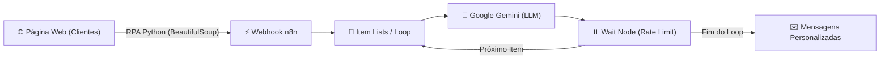

# 📈 Assistente de Investimentos com RPA e IA Generativa (n8n + Gemini)

Projeto desenvolvido como parte do Desafio de Projeto da **[DIO](https://dio.me)**, combinando técnicas de **RPA (Robotic Process Automation)** com **Orquestração no n8n** e **IA Generativa (Google Gemini)**.

---

## 🎯 Objetivo do Projeto

Automatizar a coleta de dados de clientes a partir de uma página web, orquestrar o fluxo de processamento via n8n e utilizar Inteligência Artificial Generativa para criar recomendações de investimentos totalmente personalizadas para cada perfil de investidor (Conservador, Moderado ou Arrojado).

---

## 🏗️ Arquitetura da Solução


---
## 🛠️ Tecnologias e Ferramentas
|Etapa	|Tecnologia	|Descrição
|-------|-----------|--------
|Extração (RPA)	|Python + BeautifulSoup + Requests	|Coleta dos dados dos clientes via web scraping
|Orquestração	|n8n (Docker)	|Workflow automatizado para tratamento dos dados
|Geração com IA	|Google Gemini API (gemini-3.0-flash-preview)	|Criação de mensagens personalizadas baseadas no perfil
|Resiliência / Taxa	|Loop Over Items + Wait Node (5s)	|Prevenção contra erros de taxa de requisições (429 Rate Limit)
---
📁 Estrutura do Repositório
```text
.
├── main.py              # Script Python de RPA para raspagem e envio dos dados
├── workflow-n8n.json    # Exportação do Workflow construído no n8n
└── README.md            # Documentação do projeto
```
---
🚀 Como Executar o Projeto

Pré-requisitos
Python 3.x instalado
n8n rodando localmente (via Docker ou npm)
Chave de API do Google Gemini (obtida gratuitamente no Google AI Studio)
1. Clonar o repositório
```bash
git clone https://github.com/SEU_USUARIO/dio-lab-assistente-investimentos-rpa-n8n.git
cd dio-lab-assistente-investimentos-rpa-n8n
```
2. Configurar o n8n
Acesse seu n8n local (geralmente em http://localhost:5678).
Importe o arquivo workflow-n8n.json.
Configure a sua credencial da Google Gemini API Key.
Copie a URL de Teste do nó de Webhook.

4. Executar o RPA em Python
No script main.py, atualize a variável N8N_WEBHOOK com a URL do seu n8n e execute:
```bash
pip install requests beautifulsoup4
python main.py
```
---
📊 Exemplo de Saída Gerada pela IA

Abaixo está um exemplo de recomendação gerada dinamicamente pelo Google Gemini durante a execução do fluxo:
> Olá, Ana! Notamos que você possui um perfil Conservador e um saldo disponível de R$ 1.500,00. Para o seu perfil, priorizamos a segurança e a liquidez do seu patrimônio. Indicamos opções de investimento como Tesouro Selic ou CDBs com liquidez diária, garantindo rentabilidade superior à poupança com baixíssimo risco!"


